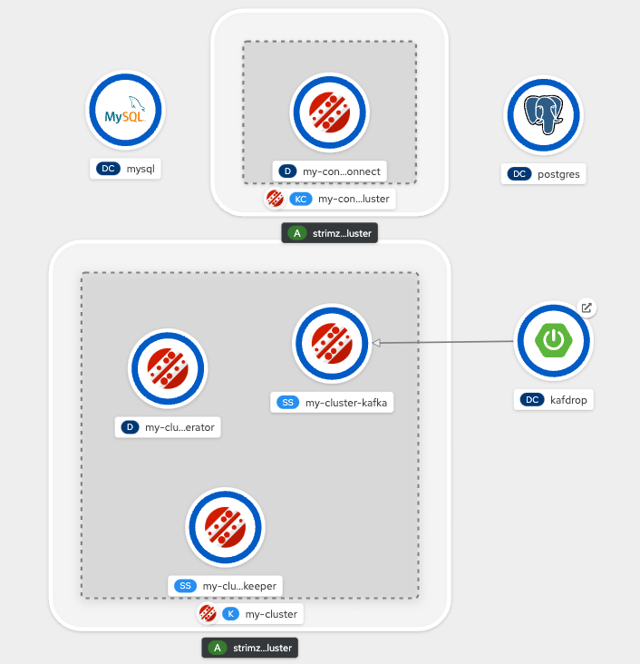

## Debezium on Openshift

This repository reproduce the simple demo from debezium tutorial in openshift environment.

### Prerequisite

Openshift Cluster 4.x

Strimzi Operator / AMQ Stream Operator

oc client cli


## Topology




## Setup Kafka, MySQL and PostgreSQL

```bash
oc new-project kafka

cd openshift
oc apply -f Kafka.yaml
oc apply -f MPvc.yaml
oc apply -f MSecret.yaml
oc apply -f Mysql.yaml
oc apply -f PPvc.yaml
oc apply -f PSecret.yaml
oc apply -f Postgres.yaml
oc apply -f kafdrop.yaml
```

## Run SQL script to create the demo database in MySQL

```bash
MYSQL_POD=$(oc get pods --output=jsonpath={.items..metadata.name} -l name=mysql)
oc cp ../mysql/inventory.sql $MYSQL_POD:/tmp/
oc exec $MYSQL_POD -- sh -c 'mysql -uroot < /tmp/inventory.sql'
```

## Create the KafkaConnector (Debezium Mysql Connector) and JdbcSink

```bash
oc apply -f KafkaConnect.yaml
oc apply -f KafkaConnector.yaml
oc apply -f JdbcSink.yaml
```


## Run the SQL in Terminal

```bash
mysql -u mysqluser inventory -p 
Enter password: <mysqlpassword>

mysql> select * from customers;
```


```bash
psql -U postgresuser inventory
inventory=> select * from customers;
```


## Perform CRUD in MySQL

```
update customers set first_name='Sally' where id=1001;
```


## Inspect kafka topics

Inspect debezium creating new record in kafka topic corresponding to the database activities.


## Check for Changes Replay in Postgres


## Clean Up

```
oc delete -f .
oc delete pvc -l strimzi.io/cluster=my-cluster
```

